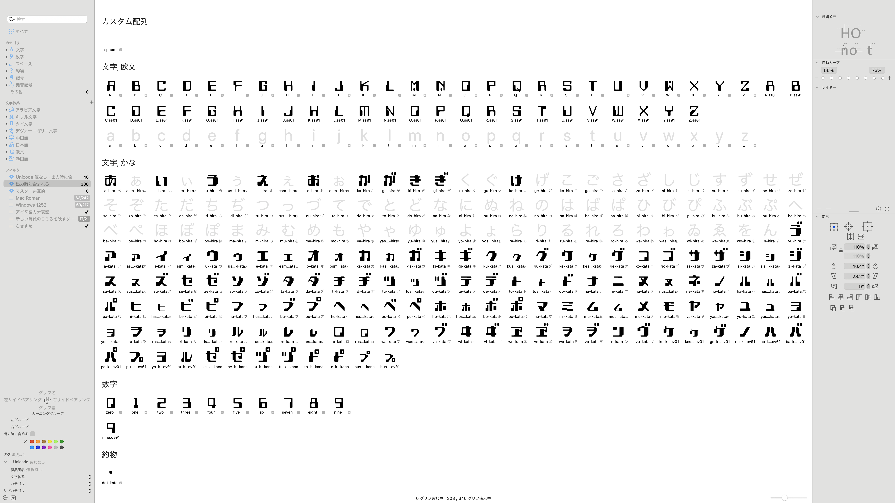

No redistribution of files
ファイルの転載禁止

# フォント 「プロプロ」 Font ProPro

音楽CD「[プログラミング・プロムナード](https://pronama.jp/2023/08/16/interview-programimng-promenade/)」に付属するMICR（磁気インク文字認識）系のフォントです。

* 音楽CDの購入者のみ使えます。今後、音楽CD購入以外の方法でも配布する場合もあります。
* たまにアップデートしていく予定です。購入者は、アップデートしたフォントも継続して使えます。

### 現在、含まれている文字一覧

* ひらがな一部
* カタカナ
* アルファベット一部
* 数字
* 一部の文字のみカーニング（特定の文字と文字の間隔）を設定しています
* 複数の字形のある文字があります（「プ」など）。OpenTypeの異字体(aalt)、文字のバリエーション(cv01, ...）に設定しています。Adobe Illustratorなど対応したアプリで参照できます。WebブラウザーとCSSで表示も可能です。

## 公開しているファイルに関して

### フォルダー
* ai: 字形検討時のファイル（最終の生成結果とは異なります）
* src: Glyphs ファイル（フォント作成ツールのソースファイル）
* release: 出力したフォントファイル（**ダウンロードはこのフォルダーからどうぞ**）

### 購入者ができること
* フォントを商用利用できます
* 例
  * Webサイト、印刷物、グッズなどの作品や製品に使用
  * WebサイトにWebフォントを組み込んで使用
  * アプリにフォントを組み込んで使用
  * 字形を変更して使用

### 制限事項
* 各ファイルの再配布を禁止します（公開、販売など）

### 購入前にできること
* 購入を検討するためにフォントファイルの検証

### ライセンス
下記の通り使ってください。
* 音楽CD1枚につき、購入者（法人の場合はデザイン担当者など）1名が使えます。
* フォントがアップデートした場合も引き続き使えます。
* 音楽CDを他人に譲渡した場合、継続して使えません（それまでにのフォントを使用した作品などはそのまま使えます）。
* 音楽CDが不要な場合、ライセンスのみの購入もできます。お問い合わせください。音楽CDとほぼ同じ金額です。

### 権利等
* 公開しているファイルには著作権があります。著作権は放棄していません。ファイルをそのまま、または改変しての公開を禁止します。
* 書体・字形には著作権等の権利は国内法では存在しません。このフォントもさまざまな書体の影響を受けています。ファイルを改変せずに、この書体に影響を受けたフォントを公開することは自由です。

## フォントへの要望

Issuesに気軽に投稿してください。

* 文字の追加要望
* 字形やカーニングの修正要望
* 字形の提案、アイデアなど

## 文字の追加依頼

有償で承ります（1文字1000円〜）。追加した文字は、ライセンス所有者全員が使えるようになります。

## お問い合わせ

[プログラミング生放送](https://pronama.jp/about/) の [お問い合わせ](https://pronama.jp/contact/) から。

